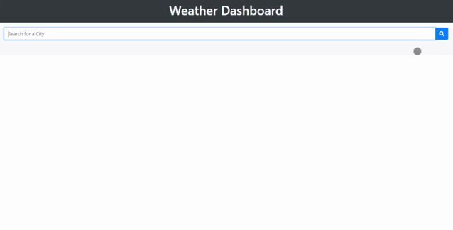

# Weather Dashboard

  
  

 

### A weather dashboard featuring current conditions and 5-day forecast

Currently deployed at [GitHub Pages](https://joeldore.github.io/Weather-Dashboard/)

---
## Features

- Provides current and future forecasts for a given city using data from [OpenWeather API](https://openweathermap.org/api)

- Search history is saved locally to display a dynamically updated list of recent cities

---
## Reflection

- Writing functions with reusability in mind helped the entire process of structuring my logic and making it more readable

- [Day.js](https://day.js.org/) objects are immutable, which made them much easier to manipulate/reformat than when I have used [Moment.js](https://momentjs.com/) on previous projects

---
## Future Development

- Add option for user to remove items from search history

- Add option for user to select Metric or Imperial units

---
##  License
This project is [MIT](https://github.com/JoelDore/Weather-Dashboard/blob/main/LICENSE) licensed.  
© 2020 [Joel Dore](https://github.com/JoelDore)  

---
 

 
 

